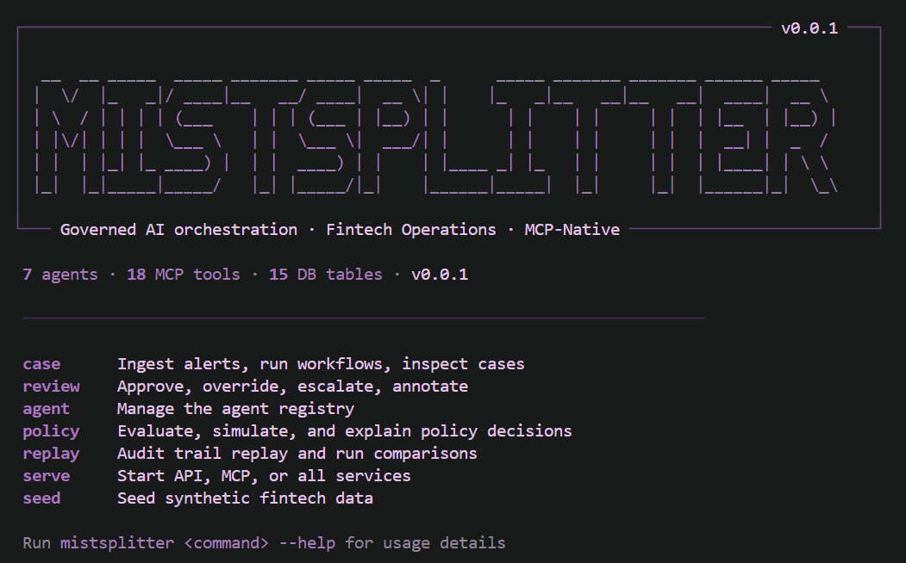

<div align="center">
  
  <p><strong>Governed AI orchestration platform for fintech operations</strong></p>
  <p>
    
    
    
    
    
    
  </p>
</div>

---

## What Is Mistsplitter

Mistsplitter is a **policy-governed, audit-centric AI orchestration platform** built for high-stakes fintech operations — fraud detection, AML, KYC, and suspicious activity review.

**This is not a chatbot.** Seven specialized AI agents gather evidence, compute risk signals, and produce structured recommendations. Humans retain final decision authority. Every agent action is permissioned. Every tool call is logged. Every outcome is immutably audited.

The platform is designed to sit inside existing fintech infrastructure — connecting to your case management system via REST API, exposing tools to AI clients via MCP, and providing a full operational web UI out of the box.

---

## How It Works

A suspicious transaction triggers the following pipeline automatically:

```
  Alert arrives
       │
       ▼
  ┌────────────────────────────────────────────────────────┐
  │                   risk_review Workflow                  │
  │                                                        │
  │  1. IntakeAgent      validates alert, creates case     │
  │  2. RetrievalAgent   fetches customer, account,        │
  │                      merchant, transaction history,    │
  │                      prior alerts and reviews          │
  │  3. SignalAgent       computes 7 risk signals          │
  │                      (amount deviation, cross-border,  │
  │                       PEP exposure, velocity, etc.)    │
  │  4. EvidenceAgent    assembles structured bundle       │
  │  5. SummaryAgent     AI generates bounded narrative    │
  │                      from structured evidence only     │
  │  6. PolicyAgent      evaluates whether to proceed      │
  └────────────────────────────────────────────────────────┘
       │
       ▼  Recommendation: clear / escalate / review
       │
  ┌────────────────────────────────────────────────────────┐
  │                  Human Review Gate                      │
  │                                                        │
  │  Reviewer sees: alert details, signals, evidence,      │
  │  AI summary, and confidence score                      │
  │                                                        │
  │  Reviewer decides: approve / override / escalate       │
  │  Override requires a mandatory reason code             │
  └────────────────────────────────────────────────────────┘
       │
       ▼
  ┌────────────────────────────────────────────────────────┐
  │              Audit Trail + Metrics Update               │
  │  Every action appended. Records never deleted.         │
  └────────────────────────────────────────────────────────┘
```

The AI never takes action autonomously. It proposes. Humans decide.

---

## Architecture

```
                    ┌─────────────────────────────────┐
                    │       Mistsplitter Platform      │
                    └─────────────────────────────────┘

  ┌──────────┐  ┌──────────┐  ┌──────────┐  ┌──────────┐
  │ REST API │  │  MCP     │  │   CLI    │  │  Web UI  │
  │ :3000    │  │ Server   │  │ Terminal │  │  :3002   │
  │ Fastify  │  │ :3001    │  │Commander │  │ Next.js  │
  └────┬─────┘  └────┬─────┘  └────┬─────┘  └────┬─────┘
       │              │              │              │
       └──────────────┴──────────────┴──────────────┘
                              │
                    ┌─────────┴──────────┐
                    │   Workflow Runtime  │
                    │   Agent Pipeline   │
                    │   Policy Engine    │
                    │   Audit Logger     │
                    └─────────┬──────────┘
                              │
                    ┌─────────┴──────────┐
                    │   PostgreSQL DB     │
                    │   (Prisma ORM)     │
                    │   15 tables        │
                    └────────────────────┘
```

**Key design principles:**
- **No LLM-generated SQL** — Prisma ORM only. AI output never touches queries directly.
- **No autonomous actions** — Every action tool requires human approval upstream.
- **Append-only audit log** — Records are never modified or deleted.
- **Zod on every boundary** — All API inputs validated; unknown fields → 400.
- **Narrow agents** — Each agent has an explicit allowlist of tools it may call.

See [`docs/architecture.md`](./docs/architecture.md) for the full reference.

---

## Platform Surfaces

| Surface | Description |
|---|---|
| **REST API** `:3000` | Cases, workflow triggers, reviews, agents, metrics, audit logs |
| **Web UI** `:3002` | Operations dashboard — case queue, detail view, audit explorer, agent registry |
| **CLI** | Full terminal interface — ingest, run, inspect, review, replay, manage agents |
| **MCP Server** `:3001` | 18 typed, permissioned tools for AI client integration *(experimental)* |

---

## CLI



```bash
# Ingest a suspicious transaction alert
mistsplitter case ingest ./fixtures/sample-alert.json

# Run the full AI agent pipeline
mistsplitter case run <case_id>

# Inspect results
mistsplitter case show <case_id>
mistsplitter case recommendation <case_id>
mistsplitter case evidence <case_id>
mistsplitter case audit <case_id>

# Human review
mistsplitter review approve <case_id>
mistsplitter review override <case_id>    # prompts for mandatory reason code
mistsplitter review escalate <case_id>

# Agent management
mistsplitter agent list
mistsplitter agent suspend <agent_id>

# Replay workflow for a case
mistsplitter replay <case_id>
```

---

## Agent Registry

Seven specialized agents, each with a narrow purpose and an explicit tool allowlist. No agent can call tools outside its registered scope.

| Agent | Purpose | Tools |
|---|---|---|
| **IntakeAgent** | Validate alert, create case | `create_case`, `validate_alert` |
| **RetrievalAgent** | Fetch all contextual records | `get_customer_profile`, `get_account_context`, `get_merchant_context`, `get_recent_transactions`, `get_prior_alerts`, `get_prior_reviews` |
| **SignalAgent** | Compute risk signals and rule hits | `compute_rule_hits`, `compute_risk_signals` |
| **EvidenceAgent** | Assemble structured evidence bundle | `build_evidence_bundle` |
| **SummaryAgent** | Generate AI narrative + recommendation | `draft_case_summary` |
| **PolicyAgent** | Evaluate workflow gates | `check_policy` |
| **ReviewLoggerAgent** | Persist review, update metrics | `submit_review_record`, `write_audit_event`, `update_metrics` |

---

## Integration

### REST API

All endpoints require `Authorization: Bearer <role>:<user_id>:<name>`.

```bash
# List cases
GET  /cases?status=pending&priority=high&limit=50

# Get case detail (alert, signals, recommendation, review, workflow)
GET  /cases/:id

# Trigger the AI workflow for a case
POST /cases/:id/run

# Submit human review
POST /cases/:id/reviews
{
  "finalAction": "approved" | "overridden" | "escalated",
  "overrideFlag": true,
  "reasonCode": "KNOWN_CUSTOMER_PATTERN",   // required if overridden
  "notes": "optional free text"
}

# Agent registry
GET  /agents
GET  /agents/:id

# Metrics snapshots
GET  /metrics

# Audit log (filterable by case, action)
GET  /audit-logs?caseId=...&action=review.*&limit=100
```

Full API reference: [`docs/architecture.md`](./docs/architecture.md)

### MCP Tools *(experimental)*

The MCP server exposes 18 typed tools across three permission tiers:

| Tier | Tools | Min Role |
|---|---|---|
| **Read** | `get_case`, `get_alert`, `get_customer_profile`, `get_account_context`, `get_merchant_context`, `get_recent_transactions`, `get_prior_alerts`, `get_prior_reviews`, `get_case_audit` | analyst |
| **Compute** | `compute_rule_hits`, `compute_risk_signals`, `build_evidence_bundle`, `draft_case_summary`, `check_policy` | workflow-agent |
| **Action** | `submit_review`, `request_escalation`, `suspend_agent`, `revoke_agent` | reviewer / admin |

MCP clients connect at `http://localhost:3001`. All tool calls require actor identity, pass a permission check, and produce an audit log entry.

Full tool schemas: [`docs/mcp-tools.md`](./docs/mcp-tools.md)

### Roles

Six roles with hierarchical access:

| Role | Access |
|---|---|
| `analyst` | Read-only — cases, alerts, audit logs, metrics |
| `reviewer` | Read + submit reviews, request escalation |
| `manager` | Reviewer + override authority |
| `admin` | Full access including agent suspension/revocation |
| `platform-engineer` | Same as admin |
| `workflow-agent` | Compute tools only — internal pipeline use |

---

## Tech Stack

| Layer | Choice |
|---|---|
| Language | TypeScript 5.5 — strict mode, no `any` |
| Runtime | Node.js 20+ |
| API | Fastify with Zod validation on all boundaries |
| Database | PostgreSQL via Prisma ORM |
| AI Model | OpenAI `gpt-4o-mini` — 30s timeout, 2-retry exponential backoff |
| AI Protocol | Model Context Protocol (`@modelcontextprotocol/sdk`) |
| CLI | Commander.js + chalk + ora |
| Web | Next.js 14 App Router (Server + Client Components) |
| Styling | Tailwind CSS |
| Validation | Zod v4 on all external inputs |
| Testing | Vitest — 288 tests across 30 suites |
| Monorepo | pnpm workspaces |

---

## Quick Start

### Prerequisites

- Node.js 20+
- pnpm 9+ (`npm install -g pnpm`)
- Docker Desktop (for PostgreSQL)
- OpenAI API key

### Setup

```bash
git clone https://github.com/nishanth1104/mistsplitter.git
cd mistsplitter

pnpm install

cp .env.example .env
# Set OPENAI_API_KEY in .env

# Start PostgreSQL
docker-compose up postgres -d

pnpm db:migrate      # apply Prisma migrations
pnpm db:seed         # seed synthetic fintech data
```

### Run

```bash
# Terminal 1 — API server
pnpm serve:api              # → http://localhost:3000

# Terminal 2 — Web UI
pnpm --filter @mistsplitter/web dev   # → http://localhost:3002
```

### End-to-end demo

```bash
pnpm demo            # runs the full AI pipeline, prints colored output
```

---

## Project Structure

```
mistsplitter/
├── packages/
│   ├── core/        # Domain types, Prisma schema, DB client, logger
│   ├── api/         # REST API — Fastify, Zod-validated routes
│   ├── workflow/    # Workflow runtime and state machine
│   ├── agents/      # 7 agent executors, registry, scope enforcement
│   ├── mcp/         # MCP server — 18 permissioned tools
│   ├── cli/         # Terminal CLI — commander, chalk, ora
│   ├── policy/      # Policy engine — workflow gate evaluation
│   └── audit/       # Append-only audit writer + replay engine
├── web/             # Next.js 14 App Router operations dashboard
├── docs/            # Architecture, data model, security model, MCP tools
├── scripts/
│   ├── seed.ts      # Synthetic fintech data seeder
│   └── demo.ts      # End-to-end workflow demo
└── fixtures/
    └── sample-alert.json   # $47,500 wire transfer alert
```

---

## Future Workflows

Mistsplitter is designed as a multi-workflow platform. The `risk_review` pipeline is Workflow 1. Planned additions:

| Workflow | Domain | Description |
|---|---|---|
| **kyc_review** | KYC | Identity verification pipeline — document check, PEP screening, sanctions match, risk tier assignment |
| **customer_support_triage** | Ops | AI-assisted support ticket classification, routing, and resolution suggestion |
| **payments_dispute** | Disputes | Chargeback and dispute handling — evidence gathering, merchant verification, resolution recommendation |
| **financial_crime_triage** | AML | Batch SAR candidate screening — network analysis, transaction graph signals, regulatory threshold monitoring |
| **onboarding_risk** | KYC | New customer onboarding risk assessment — source of funds, beneficial ownership, adverse media |

Each workflow follows the same pattern: alert/trigger → agent pipeline → human review gate → audit trail. New workflows plug into the existing runtime, agent registry, and policy engine without platform changes.

---

## Testing

```bash
pnpm test          # 288 tests across 30 suites — agents, workflow, API routes, MCP permissions, audit
pnpm typecheck     # strict TypeScript across all 8 packages — zero errors
```

---

## Documentation

| Doc | Description |
|---|---|
| [`docs/architecture.md`](./docs/architecture.md) | System architecture, component design, data flow |
| [`docs/data-model.md`](./docs/data-model.md) | Prisma schema reference and entity relationships |
| [`docs/mcp-tools.md`](./docs/mcp-tools.md) | All 18 MCP tools — schemas, permissions, examples |
| [`docs/security-model.md`](./docs/security-model.md) | Threat model, auth design, audit integrity guarantees |
| [`docs/workflow-walkthrough.md`](./docs/workflow-walkthrough.md) | End-to-end walkthrough of the risk\_review workflow |

---

## License

MIT
